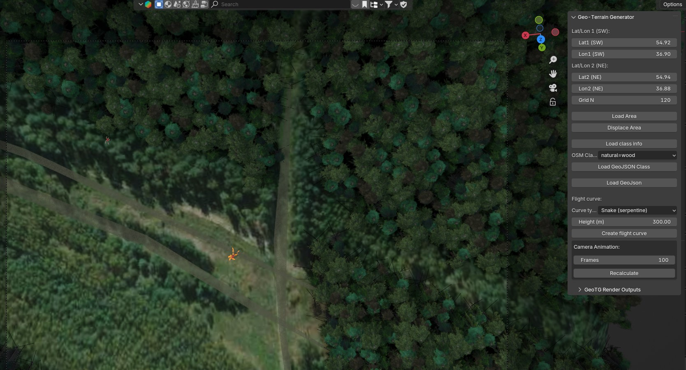
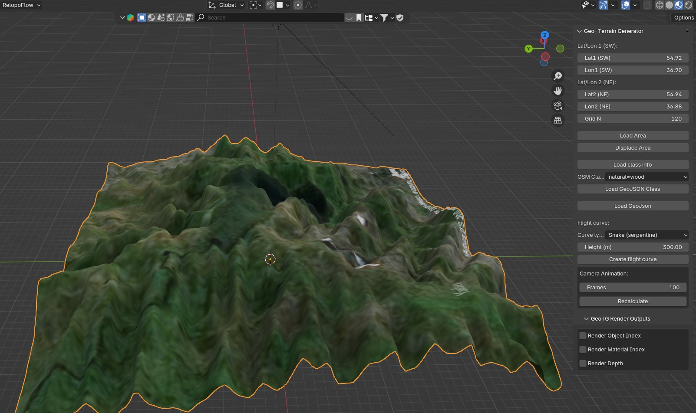
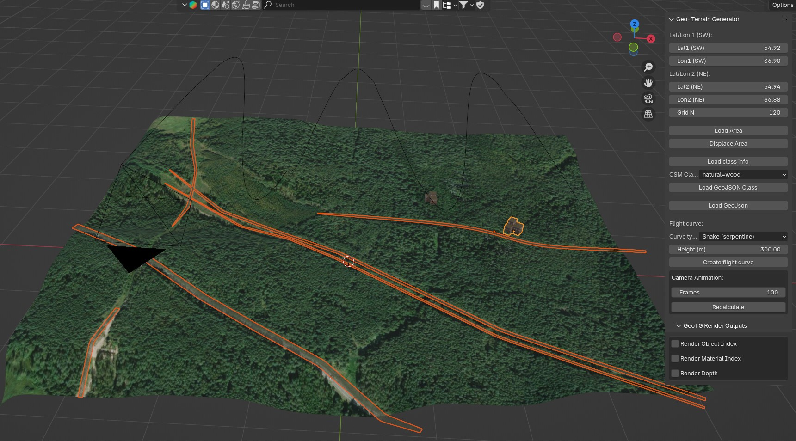

# Geo-Terrain Generator

**Geo-Terrain Generator** — это современный Blender-аддон для автоматизированного создания синтетических 3D-сцен, спутниковых рендеров и аннотаций для задач компьютерного зрения, фотограмметрии и обучения нейросетей. Проект предназначен для исследователей, инженеров и студентов, которым необходимы реалистичные датасеты с управляемой геометрией, текстурами и метаданными.

---

## Основные возможности

- **Генерация 3D-террейна** по спутниковым снимкам и цифровым моделям рельефа (DEM: SRTM, ArcticDEM, REMA)
- **Автоматическая загрузка ортофото** с Яндекс.Карт (или других провайдеров)
- **Процедурное размещение ассетов**: деревья, здания, дороги, люди, реки (поддержка OSM-геометрии и собственных моделей)
- **Гибкие пресеты**: параметры камер (размер сенсора, фокус, pitch), погодные условия (HDRI), время суток
- **Построение и анимация траекторий** пролёта камеры (прямые, круговые, змейка, спираль, кастомные)
- **Автоматическая разметка**: маски объектов, материалов, глубины, экспорт аннотаций для CV-задач
- **Геометрическая и фотометрическая аугментация** (через Blender и внешние скрипты)
- **Интуитивный интерфейс** прямо в Blender (панели, быстрые операции, предпросмотр)
- **Работа с ассетами**: поддержка .blend, .fbx, HDRI, png/jpg текстур

---

## Структура проекта

- `geoterrain_generator/` — основной Python-пакет аддона
  - `core/` — работа с DEM, геоданными, текстурами, тайлами
  - `operators/` — операторы Blender: генерация террейна, загрузка ассетов, создание траекторий, работа с камерой, OSM
  - `ui/` — пользовательские панели и настройки
  - `assets/` — примеры ассетов: деревья, здания, HDRI, текстуры
  - `libs/` — вспомогательные скрипты (например, загрузка тайлов)
  - `vendor/` — сторонние библиотеки и утилиты
- `README.md` — документация и примеры

---

## Быстрый старт

1. Скачайте архив с последней версией аддона с [GitHub Releases](https://github.com/your-repo/releases)
2. В Blender (4.2+) перейдите в `Edit → Preferences → Add-ons → Install...` и выберите скачанный архив
3. Активируйте аддон в списке
4. В панели аддона введите API-ключ Яндекс.Карт (можно получить [здесь](https://developer.tech.yandex.ru/services))
5. Задайте координаты участка, загрузите ортофото и DEM, настройте ассеты и параметры камеры
6. Генерируйте уникальные датасеты и аннотации!

---

## Галерея

|  |  |
|:-------------------------------------:|:---------------------------------------:|
| Вид из камеры                         | Траектория камеры                       |

|                 |  |
|:-------------------------------------:|:-----------------------------------------------:|
| Цифровая модель рельефа (DEM)         | Карта Material ID                               |

|             |                                               |
|:-------------------------------------:|:---------------------------------------------:|
| Дороги                                |                                               |

---

## Видеодемонстрация

> _Видео-демонстрация возможностей аддона_

---

## Требования

- Blender 4.2+ (Windows, Linux, macOS)
- Python 3.11+
- API-ключ Яндекс.Карт (для загрузки спутниковых снимков)
- Интернет для загрузки DEM и ортофото

---

## Ассеты и пресеты

- Деревья, люди, дороги, реки, здания (примерные ассеты в папке `assets/`)
- HDRI-освещение, погодные и временные пресеты
- Камеры и траектории пролёта (поддержка популярных сенсоров и ручных настроек)

---

## Архитектура и расширяемость

- Открытый код, модульная архитектура, легко добавлять свои ассеты, операторы и сценарии
- Поддержка внешних источников DEM и ортофото (можно реализовать свои плагины)
- Возможность интеграции с пайплайнами CV/ML через экспорт аннотаций и масок

---

## Контакты и поддержка

- [GitHub Issues](https://github.com/Kon4ka/landscape_from_map/issues) — баги и предложения
- [Документация](https://github.com/Kon4ka/landscape_from_map/tree/main/geoterrain_generator)

---

